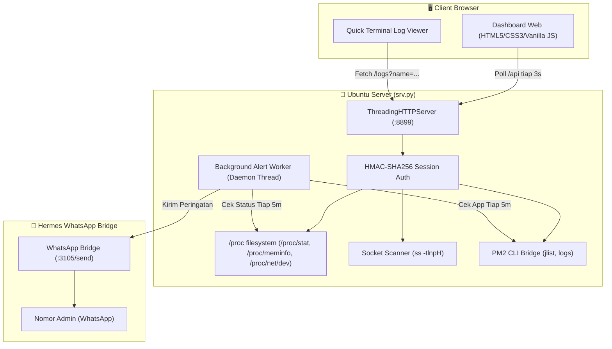

<div align="center">

# ⚙️ Monitor Ubuntu

### **Ultra-Lightweight, Modern & Single-File Server Monitoring Dashboard**
*Dashboard monitoring server Linux modern, cepat, aman, dan tanpa dependensi eksternal (100% Python Standard Library).*

<br/>

[](https://www.python.org/)
[](https://ubuntu.com/)
[-2ea44f?style=for-the-badge)](https://github.com/azisfata/monitor-ubuntu)
[](LICENSE)

<br/>

```text
 ┌─────────────────────────────────────────────────────────────────────────────┐
 │ ⚙️ server     [↓ 12 KB/s · ↑ 170 KB/s] [up 1d 4h] [sw 0/4G]  ● LIVE 10:50:00│
 ├─────────────────────────────────────────────────────────────────────────────┤
 │   ╭──────────╮    ╭──────────╮    ╭──────────╮    ╭──────────╮              │
 │   │  14.2 %  │    │  31.0 %  │    │  18.7 %  │    │   1.25   │              │
 │   │   CPU    │    │   MEM    │    │   DISK   │    │   LOAD   │              │
 │   ╰──────────╯    ╰──────────╯    ╰──────────╯    ╰──────────╯              │
 │                                                                             │
 │ ▶ APPS & PM2 SERVICES (7)                                                   │
 │ ┌──────────────────────┐ ┌──────────────────────┐ ┌───────────────────────┐ │
 │ │ ● sapa-server      ↗ │ │ ● dsh-web          ↗ │ │ ● hermes-dashboard  ↗ │ │
 │ │ [📄 log] [↻] [■]     │ │ [📄 log] [↻] [■]     │ │ [📄 log] [↻] [■]      │ │
 │ │ 0.5% · 105MB · up 2h │ │ 1.6% · 755MB · up 2h │ │ 0.5% · 143MB · up 2h  │ │
 │ └──────────────────────┘ └──────────────────────┘ └───────────────────────┘ │
 └─────────────────────────────────────────────────────────────────────────────┘
```

</div>

---

## 🌟 Mengapa Monitor Ubuntu?

- 🪶 **Ultra-Ringan**: Hanya satu file Python tunggal (`srv.py`), konsumsi memori hanya **~8 MB RAM**, dan pemakaian CPU **< 0.01%**.
- 📦 **Zero External Dependencies**: Tidak memerlukan `pip install`, tidak membutuhkan Redis/Database eksternal, hanya murni menggunakan modul bawaan Python (*Standard Library*).
- ⚡ **Super Cepat & Responsif**: Backend asinkron/multithreaded dengan waktu respon API sub-milidetik (< 15ms) dan auto-refresh 3 detik.
- 🎨 **Tampilan Modern & Dinamis**: Desain gelap (*dark theme*) elegan dengan 4 SVG arc gauges simetris di grid utama, badge header informatif, dan adaptif untuk Mobile, Tablet, serta Desktop.
- 📱 **WhatsApp Alerting Built-in**: Peringatan otomatis langsung ke WhatsApp admin saat aplikasi PM2 bermasalah atau RAM/Disk kritis (>90%).

---

## 📊 Fitur-Fitur Utama

### 1. 📈 Real-Time Dynamic Metrics
- **Dynamic Semi-Circle SVG Gauges**: Indikator melengkung halus untuk **CPU**, **RAM**, **DISK**, dan **LOAD** dengan pewarnaan dinamis 5-level:
  - 🟢 **Normal** ($<30\%$) $\rightarrow$ 🩵 **Rendah** ($30-54\%$) $\rightarrow$ 🟡 **Sedang** ($55-74\%$) $\rightarrow$ 🟠 **Tinggi** ($75-89\%$) $\rightarrow$ 🔴 **Kritis** ($\ge 90\%$)
- **Header Info Badges (Sticky Navbar)**:
  - **Live Network Bandwidth**: Kecepatan Download ($\downarrow$ RX) & Upload ($\uparrow$ TX) real-time dari delta `/proc/net/dev`.
  - **Server Uptime**: Durasi server aktif (`up 1d 4h`).
  - **Swap Memory Detail**: Kapasitas Swap terpakai vs total (`sw 0/4G`).
  - **Live Status Pulse**: Indikator titik hijau berkedip real-time lengkap dengan waktu server.

### 2. 🚀 Unified Apps & PM2 Manager
- Menyatukan daftar Web Portal dan PM2 Service dalam satu grid kartu interaktif.
- **Dual-Layer Health Check Verification**: Memverifikasi status hidup aplikasi secara berlapis (proses PM2 berstatus `online` **DAN** socket port web benar-benar telah terbuka & merespons), sehingga saat aplikasi sedang restart/booting (*cold start*), indikator akan menampilkan warna **Merah/Oranye (`starting...` / `restarting...`)** sampai port benar-benar siap melayani koneksi.
- **Smart URL Resolving**: Menyesuaikan IP/Domain klien secara otomatis, atau dikunci ke `127.0.0.1` (misal untuk `dsh-web`) yang siap diakses via SSH Port Forwarding.
- **Live Metrics Badge**: Menampilkan persentase CPU, pemakaian RAM, dan uptime/status tiap aplikasi secara individual.
- **Quick Action Buttons**: Tombol interaktif untuk **Restart (↻)**, **Stop (■)**, dan **Start (▶)** aplikasi langsung dari browser.

### 3. 📄 Interactive Quick Log Viewer
- Modal terminal pop-up instan untuk membaca 50–100 baris log PM2 (*stdout* & *stderr*) tanpa perlu login SSH ke server.
- Dilengkapi tombol **↻ Refresh Log** dan **📋 Copy to Clipboard**.

### 4. 🛡️ Systemd Core Services & Docker Monitor
- **Systemd Watcher**: Memantau status unit sistem dan user unit penting (`tailscaled`, `nginx`, `docker`, `ssh`, `postgresql`, `redis-server`, `hermes-gateway`).
- **Docker Containers**: Deteksi dinamis semua container Docker yang sedang berjalan beserta statusnya (`Up`, `Exited`, port).

### 5. 🔍 Ports, Services & Top Processes
- **Port Scanner & Health Checker**: Pemindaian port listening via `ss -tlnpH` dan verifikasi HTTP/HTTPS/TCP paralel.
- **Top Memory Processes**: Pelacakan 8 proses teratas pemakan RAM dari `/proc/*/status` dengan resolusi nama aplikasi otomatis.

### 6. 🔔 WhatsApp Background Alert Notifier
- Daemon background ultra-ringan yang mengecek kesehatan server secara berkala tiap **5 menit**.
- Mengirim pesan WhatsApp instan via Hermes Bridge jika:
  - Ada aplikasi PM2 berstatus `errored` atau `stopped`.
  - Pemakaian RAM fisik atau Disk melebihi **90%**.
- **Fitur Anti-Spam Cooldown**: Jeda peringatan **1 jam** per insiden + notifikasi **Recovery** otomatis saat server pulih kembali.

---

## 🚦 Arsitektur & Efisiensi Sistem



---

## ⚡ Panduan Instalasi & Penggunaan

### 1. Menjalankan Langsung (Testing / Standalone)
```bash
python3 srv.py
```
Buka browser Anda dan akses: `http://<IP-SERVER>:8899`

---

### 2. Menjalankan di Background dengan PM2 (Direkomendasikan)
Gunakan PM2 agar service monitor otomatis berjalan di background dan hidup kembali saat server di-reboot:

```bash
# Clone repositori
git clone https://github.com/azisfata/monitor-ubuntu.git ~/monitor
cd ~/monitor

# Jalankan dengan PM2
pm2 start srv.py --name monitor --interpreter python3

# Simpan state PM2 untuk auto-start saat reboot
pm2 save
```

---

## ⚙️ Variabel Lingkungan (*Environment Variables*)

Semua pengaturan bersifat opsional dengan nilai bawaan yang siap pakai:

| Variabel | Tipe | Default | Penjelasan |
| :--- | :---: | :---: | :--- |
| `PORT` | *Integer* | `8899` | Port HTTP listen server |
| `MONITOR_USER` | *String* | `fata` | Username login dashboard |
| `MONITOR_PASS` | *String* | `1232` | Password login dashboard |
| `MONITOR_TOKEN` | *String* | `.token` file / fallback | Secret key untuk penandatanganan cookie sesi HMAC |
| `MONITOR_WA_ADMIN` | *String* | Auto dari `.env` Hermes | Nomor tujuan notifikasi WhatsApp (format: `6281335004509`) |
| `MONITOR_ALERT_INTERVAL` | *Integer* | `300` | Interval pengecekan background dalam detik (default: 5 menit) |
| `MONITOR_ALERT_COOLDOWN` | *Integer* | `3600` | Jeda anti-spam pengiriman ulang alert dalam detik (default: 1 jam) |

---

## 🔒 Keamanan & Praktik Terbaik

- 🔑 **Password Hashing**: Menggunakan `hashlib.sha256` dengan perbandingan `hmac.compare_digest` untuk mencegah *timing attacks*.
- 🛡️ **Signed Session Cookies**: Cookie sesi ditandatangani secara kriptografis menggunakan algoritma `HMAC-SHA256` dengan TTL 30 hari.
- 🗂️ **Allowlist Log Viewer**: Endpoint `/logs` hanya mengizinkan nama aplikasi yang terdaftar di PM2 untuk mencegah *Path Traversal*.
- 🌐 **Zero External Callout**: Dashboard tidak memuat file CSS/JS dari CDN eksternal sehingga aman digunakan di jaringan privat/intranet tanpa akses internet publik.

---

## 📄 Lisensi
Proyek ini didistribusikan di bawah lisensi [MIT License](LICENSE).
