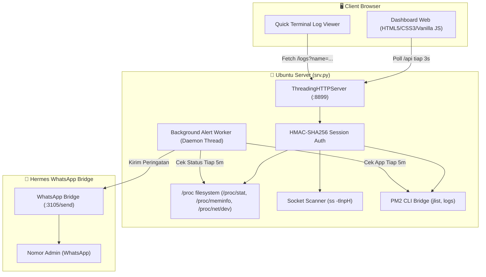

<div align="center">

# ⚙️ Monitor Ubuntu

### **Ultra-Lightweight, Modern & Single-File Server Monitoring Dashboard**
*Dashboard monitoring server Linux modern, cepat, aman, dan tanpa dependensi eksternal (100% Python Standard Library).*

<br/>

[](https://www.python.org/)
[](https://ubuntu.com/)
[-2ea44f?style=for-the-badge)](https://github.com/azisfata/monitor-ubuntu)
[](LICENSE)

<br/>

```text
 ┌─────────────────────────────────────────────────────────────────────────────┐
 │ ⚙️ server     [↓ 12 KB/s · ↑ 170 KB/s] [up 1d 4h] [sw 0/4G]  ● LIVE 10:50:00│
 ├─────────────────────────────────────────────────────────────────────────────┤
 │   ╭──────────╮    ╭──────────╮    ╭──────────╮    ╭──────────╮              │
 │   │  14.2 %  │    │  31.0 %  │    │  18.7 %  │    │   1.25   │              │
 │   │   CPU    │    │   MEM    │    │   DISK   │    │   LOAD   │              │
 │   ╰──────────╯    ╰──────────╯    ╰──────────╯    ╰──────────╯              │
 │                                                                             │
 │ ▶ APPS & PM2 SERVICES (7)                                                   │
 │ ┌──────────────────────┐ ┌──────────────────────┐ ┌───────────────────────┐ │
 │ │ ● sapa-server      ↗ │ │ ● dsh-web          ↗ │ │ ● hermes-dashboard  ↗ │ │
 │ │ [📄 log] [↻] [■]     │ │ [📄 log] [↻] [■]     │ │ [📄 log] [↻] [■]      │ │
 │ │ 0.5% · 105MB · up 2h │ │ 1.6% · 755MB · up 2h │ │ 0.5% · 143MB · up 2h  │ │
 │ └──────────────────────┘ └──────────────────────┘ └───────────────────────┘ │
 └─────────────────────────────────────────────────────────────────────────────┘
```

</div>

---

## 🌟 Mengapa Monitor Ubuntu?

- 🪶 **Ultra-Ringan**: Hanya satu file Python tunggal (`srv.py`), konsumsi memori hanya **~8 MB RAM**, dan pemakaian CPU **< 0.01%**.
- 📦 **Zero External Dependencies**: Tidak memerlukan `pip install`, tidak membutuhkan Redis/Database eksternal, hanya murni menggunakan modul bawaan Python (*Standard Library*).
- ⚡ **Super Cepat & Responsif**: Backend multithreaded dengan cache snapshot (TTL 2 detik, configurable) dan probe paralel. Port non-HTTP (SSH/DNS/RDP/DB) dicek via TCP langsung sehingga tidak lagi membakar timeout — `/api` merespons dalam **~150 ms** pada 15 port listening (bukan 2+ detik seperti versi sebelumnya). Auto-refresh 3 detik.
- 🎨 **Tampilan Modern & Dinamis**: Desain gelap (*dark theme*) elegan dengan 4 SVG arc gauges simetris di grid utama, badge header informatif, dan adaptif untuk Mobile, Tablet, serta Desktop.
- 📱 **WhatsApp Alerting Built-in**: Peringatan otomatis langsung ke WhatsApp admin saat aplikasi PM2 bermasalah atau RAM/Disk kritis (>90%).

---

## 📊 Fitur-Fitur Utama

### 1. 📈 Real-Time Dynamic Metrics
- **Dynamic Semi-Circle SVG Gauges**: Indikator melengkung halus untuk **CPU**, **RAM**, **DISK**, dan **LOAD** dengan pewarnaan dinamis 5-level:
  - 🟢 **Normal** ($<30\%$) $\rightarrow$ 🩵 **Rendah** ($30-54\%$) $\rightarrow$ 🟡 **Sedang** ($55-74\%$) $\rightarrow$ 🟠 **Tinggi** ($75-89\%$) $\rightarrow$ 🔴 **Kritis** ($\ge 90\%$)
- **Header Info Badges (Sticky Navbar)**:
  - **Live Network Bandwidth**: Kecepatan Download ($\downarrow$ RX) & Upload ($\uparrow$ TX) real-time dari delta `/proc/net/dev`.
  - **Server Uptime**: Durasi server aktif (`up 1d 4h`).
  - **Swap Memory Detail**: Kapasitas Swap terpakai vs total (`sw 0/4G`).
  - **Live Status Pulse**: Indikator titik hijau berkedip real-time lengkap dengan waktu server.

### 2. 🚀 Unified Apps & PM2 Manager
- Menyatukan daftar Web Portal dan PM2 Service dalam satu grid kartu interaktif.
- **Dual-Layer Health Check Verification**: Memverifikasi status hidup aplikasi secara berlapis (proses PM2 berstatus `online` **DAN** socket port web benar-benar telah terbuka & merespons), sehingga saat aplikasi sedang restart/booting (*cold start*), indikator akan menampilkan warna **Merah/Oranye (`starting...` / `restarting...`)** sampai port benar-benar siap melayani koneksi.
- **Smart URL Resolving**: Menyesuaikan IP/Domain klien secara otomatis, atau dikunci ke `127.0.0.1` (misal untuk `dsh-web`) yang siap diakses via SSH Port Forwarding.
- **Live Metrics Badge**: Menampilkan persentase CPU, pemakaian RAM, dan uptime/status tiap aplikasi secara individual.
- **Quick Action Buttons**: Tombol interaktif untuk **Restart (↻)**, **Stop (■)**, dan **Start (▶)** aplikasi langsung dari browser.

### 3. 📄 Interactive Quick Log Viewer
- Modal terminal pop-up instan untuk membaca 50–100 baris log PM2 (*stdout* & *stderr*) tanpa perlu login SSH ke server.
- Dilengkapi tombol **↻ Refresh Log** dan **📋 Copy to Clipboard**.

### 4. 🛡️ Systemd Core Services & Docker Monitor
- **Systemd Watcher**: Memantau unit sistem dan user secara dinamis — isi `systemd_units` di config, atau biarkan kosong untuk auto-discover dari kandidat generik (`docker`, `ssh`, `nginx`, `tailscaled`, `postgresql`, `redis`, `ollama`, `ufw`, `fail2ban`, `cockpit`, …) dan hanya menampilkan yang benar-benar ter-install.
- **Docker Containers**: Menampilkan container yang sedang berjalan. Container `Exited` disembunyikan secara default (isi `"docker_all": true` untuk melihat semuanya).

### 5. 🔍 Ports, Services & Top Processes
- **Port Scanner & Health Checker**: Pemindaian port listening via `ss -tlnpH` dan verifikasi HTTP/HTTPS/TCP paralel.
- **Top Memory Processes**: Pelacakan 8 proses teratas pemakan RAM dari `/proc/*/status` dengan resolusi nama aplikasi otomatis.

### 6. 🔔 WhatsApp Background Alert Notifier
- Daemon background ultra-ringan yang mengecek kesehatan server secara berkala tiap **5 menit**.
- Mengirim pesan WhatsApp instan via Hermes Bridge jika:
  - Ada aplikasi PM2 berstatus `errored` atau `stopped`.
  - Pemakaian RAM fisik atau Disk melebihi **90%**.
- **Fitur Anti-Spam Cooldown**: Jeda peringatan **1 jam** per insiden + notifikasi **Recovery** otomatis saat server pulih kembali.

---

## 🚦 Arsitektur & Efisiensi Sistem


```mermaid
flowchart TD
    subgraph Browser["🖥️ Client Browser"]
        UI["Dashboard Web (HTML5/CSS3/Vanilla JS)"]
        MODAL["Quick Terminal Log Viewer"]
    end

    subgraph Server["🐧 Ubuntu Server (srv.py)"]
        HTTP["ThreadingHTTPServer (:8899)"]
        AUTH["HMAC-SHA256 Session Auth"]
        PROC["/proc filesystem (/proc/stat, /proc/meminfo, /proc/net/dev)"]
        SS["Socket Scanner (ss -tlnpH)"]
        PM2["PM2 CLI Bridge (jlist, logs)"]
        ALERT["Background Alert Worker (Daemon Thread)"]
    end

    subgraph WA["📱 Hermes WhatsApp Bridge"]
        BRIDGE["WhatsApp Bridge (:3105/send)"]
        ADMIN["Nomor Admin (WhatsApp)"]
    end

    UI -->|Poll /api tiap 3s| HTTP
    MODAL -->|Fetch /logs?name=...| HTTP
    HTTP --> AUTH
    AUTH --> PROC
    AUTH --> SS
    AUTH --> PM2
    ALERT -->|Cek Status Tiap 5m| PROC
    ALERT -->|Cek App Tiap 5m| PM2
    ALERT -->|Kirim Peringatan| BRIDGE
    BRIDGE --> ADMIN
```

---

## ⚡ Panduan Instalasi & Penggunaan

### 1. Instalasi Otomatis (Rekomendasi)

```bash
git clone https://github.com/azisfata/monitor-ubuntu.git ~/monitor
cd ~/monitor
./install.sh
```

`install.sh` akan:
1. Membuat `monitor.conf.json` (permission `600`) dengan **password acak** — bukan `admin/admin`.
2. Membuat symlink CLI ke `~/.local/bin/monitor`.
3. Membuat + enable service `systemd --user` (`monitor.service`).

Variable lingkungan (opsional, untuk instalasi non-interaktif):

```bash
MONITOR_PORT=8899 MONITOR_USER=admin MONITOR_PASS='rahasia-kuat' ./install.sh
```

> **Penting:** service `systemd --user` berhenti saat user logout / reboot kecuali *linger* aktif. Ikuti petunjuk yang ditampilkan installer, atau jalankan manual:
> ```bash
> sudo loginctl enable-linger $(id -un)
> ```

### 2. Menjalankan Langsung (Testing / Standalone)

```bash
python3 srv.py
```

Tanpa `monitor.conf.json`, server akan **membuat sendiri** password acak, menampilkannya sekali di terminal, lalu menyimpannya ke `monitor.conf.json`. Buka browser: `http://<IP-SERVER>:8899`

---

### 3. Menjalankan di Background dengan PM2 (Alternatif)

```bash
pm2 start srv.py --name monitor --interpreter python3
pm2 save
```

> Jangan memakai `MONITOR_USER`/`MONITOR_PASS` bila konfigurasi sudah tersimpan di `monitor.conf.json` — env hanya dipakai sebagai *fallback*.

> **Catatan `PORT` vs file config:** `install.sh` menulis `Environment=PORT=` di service file, dan env **menang** atas file config. Kalau mengubah port di `monitor.conf.json` sementara service tetap menyetel `PORT`, edit juga unit-nya (`systemctl --user edit monitor.service`).

---

## ⚙️ Konfigurasi (`monitor.conf.json`)

Semua opsional. Lihat `monitor.conf.example.json`. Env var **menang** atas file config.

| Key | Tipe | Default | Penjelasan |
| :--- | :--- | :--- | :--- |
| `port` | int | `8899` | Port HTTP listen |
| `title` | string | `server` | Judul di header dashboard |
| `users` | object | — | **Wajib.** `{"user": "password"}` |
| `web` | array | `[]` | Bookmark statis: `[{"name":"app","port":8080,"path":"/","desc":"..."}]` |
| `known` | object | `{}` | Label port: `{"8080":"myapp"}` |
| `hide_ports` | array | `[20241]` | Port yang disembunyikan dari daftar |
| `infra_skip_apps` | array | `[22,53,631,3389]` | Port infra yang tidak masuk grid Apps |
| `non_http_ports` | array | `[22,53,631,3389,3306,…]` | Port yang dicek via TCP saja, tanpa probe HTTP |
| `max_port` | int | `32768` | Batas atas port yang dipindai |
| `systemd_units` | array | auto | Kosong = auto-discover dari kandidat generik |
| `probe_timeout` | int | `1` | Timeout probe (detik) |
| `snapshot_ttl` | float | `2.0` | Cache snapshot (detik). `0` = tanpa cache |
| `docker_all` | bool | `false` | `true` = tampilkan juga container yang exited |
| `alert.*` | object | lihat contoh | Interval/cooldown/threshold/WhatsApp |

**Tidak ada kredensial default.** Kalau `users` kosong dan file config sudah ada, server **menolak start** dengan pesan jelas — bukan diam-diam memakai `admin/admin`.

---

## ⚙️ Variabel Lingkungan (*Environment Variables*)

| Variabel | Tipe | Default | Penjelasan |
| :--- | :---: | :--- | :--- |
| `PORT` / `MONITOR_PORT` | *Integer* | `8899` | Port HTTP listen (menang atas file config) |
| `MONITOR_CONF` | *String* | `./monitor.conf.json` | Lokasi file config |
| `MONITOR_USER` | *String* | — | Username login (fallback bila `users` kosong) |
| `MONITOR_PASS` | *String* | — | Password login (fallback bila `users` kosong) |
| `MONITOR_TITLE` | *String* | `server` | Judul dashboard |
| `MONITOR_TOKEN` | *String* | `.token` (auto-generate) | Secret penandatanganan cookie sesi HMAC |
| `MONITOR_MAX_PORT` | *Integer* | `32768` | Batas atas port yang dipindai |
| `MONITOR_PROBE_TIMEOUT` | *Integer* | `1` | Timeout probe dalam detik |
| `MONITOR_SNAPSHOT_TTL` | *Float* | `2.0` | TTL cache snapshot |
| `MONITOR_HIDE_PORTS` | *CSV* | `20241` | Port yang disembunyikan |
| `MONITOR_INFRA_SKIP` | *CSV* | `22,53,631,3389` | Port infra yang tidak masuk grid Apps |
| `MONITOR_SYSTEMD_UNITS` | *CSV* | auto | Unit systemd yang dipantau |
| `MONITOR_KNOWN_JSON` | *JSON* | `{}` | Label port tambahan |
| `MONITOR_WEB_JSON` | *JSON* | `[]` | Bookmark aplikasi (JSON array) |
| `MONITOR_ALERT_INTERVAL` | *Integer* | `300` | Interval pengecekan alert (detik) |
| `MONITOR_ALERT_COOLDOWN` | *Integer* | `3600` | Jeda anti-spam alert (detik) |
| `MONITOR_RAM_THRESHOLD` | *Float* | `90` | Ambang RAM kritis (%) |
| `MONITOR_DISK_THRESHOLD` | *Float* | `90` | Ambang disk kritis (%) |
| `MONITOR_WA_ADMIN` | *String* | dari `.env` Hermes | Nomor WhatsApp tujuan alert |
| `MONITOR_WA_BRIDGE` | *String* | `http://127.0.0.1:3105/send` | Endpoint bridge WhatsApp |
| `MONITOR_WA_ENV_FILE` | *String* | `~/.hermes/.env` | Sumber `WHATSAPP_ALLOWED_USERS` |

---

## 🖥️ Command-Line Interface (`monitor` CLI)

Selain web dashboard, Anda dapat memantau server dan melihat semua link akses aplikasi langsung dari terminal menggunakan perintah `monitor`:

```bash
# Symlink ke binary lokal — biasanya sudah dibuat oleh ./install.sh
ln -sf ~/monitor/cli.py ~/.local/bin/monitor
chmod +x ~/monitor/cli.py
```

### Penggunaan di Terminal:
```bash
# 1. Tampilkan ringkasan sistem, status semua aplikasi, dan alamat aksesnya
monitor

# 2. Tampilkan token autentikasi dsh-web (DeepSeek) & panduan SSH tunneling
monitor token

# 3. Restart service monitor atau aplikasi tertentu
monitor restart
monitor restart sapa-server

# 4. Lihat status PM2 semua service
monitor status

# 5. Baca live log aplikasi
monitor logs monitor
monitor logs dsh-web 100

# 6. Ekspor seluruh snapshot sistem dalam format JSON
monitor json
```

### Preview Tampilan Terminal:
```text
╭──────────────────────────────────────────────────────────────────────────────╮
│  DECK • Server Monitor & Application Directory                               │
│  Host: 100.126.4.94 (Tailscale) • 192.168.10.149 (LAN)                       │
│  Uptime: 4d 17h 20m │ CPU: 0.0% │ RAM: 3.3/7.7GB (43.6%) │ Disk: 19.5%       │
╰──────────────────────────────────────────────────────────────────────────────╯

  DAFTAR APLIKASI & ALAMAT AKSES:
  ────────────────────────────────────────────────────────────────────────────
  ● link-shortener     [ONLINE]  (Port: 8080 │ RAM: 18MB │ CPU: 0%)
     ├─ Domain   : https://s.kemenkopmk.go.id
     ├─ Tailscale: http://100.126.4.94:8080
     └─ LAN      : http://192.168.10.149:8080

  ● adminer            [ONLINE]  (Port: 9090 │ RAM: 31MB │ CPU: 0%)
     ├─ Tailscale: http://100.126.4.94:9090
     └─ LAN      : http://192.168.10.149:9090

  ● cockpit            [ONLINE]  (Port: 9091)
     ├─ Tailscale: http://100.126.4.94:9091
     └─ LAN      : http://192.168.10.149:9091

  ● 9router            [ONLINE]  (Port: 20128 │ RAM: 198MB │ CPU: 0.4%)
     ├─ Tailscale: http://100.126.4.94:20128/dashboard
     └─ LAN      : http://192.168.10.149:20128/dashboard

  ● dsh-web            [ONLINE]  (Port: 3080 │ RAM: 986MB │ CPU: 3.4%)
     ├─ Local URL: http://127.0.0.1:3080/?token=...
     └─ Akses SSH: ssh -L 3080:localhost:3080 fata@100.126.4.94

  ● hermes-dashboard   [ONLINE]  (Port: 9119 │ RAM: 286MB │ CPU: 0.8%)
     ├─ Tailscale: http://100.126.4.94:9119
     └─ LAN      : http://192.168.10.149:9119

  ● sapa-server        [ONLINE]  (Port: 3000 │ RAM: 105MB │ CPU: 0.2%)
     ├─ API Route: https://sapa.kemenkopmk.go.id/api/
     ├─ Tailscale: http://100.126.4.94:3000
     └─ LAN      : http://192.168.10.149:3000

  ● pub-fata           [ONLINE]  (Port: 4080 │ RAM: 77MB │ CPU: 0.2%)
     ├─ Tailscale: http://100.126.4.94:4080
     └─ LAN      : http://192.168.10.149:4080

  ● monitor              [ONLINE]  (Port: 8899 │ RAM: 24MB │ CPU: 0%)
     ├─ Tailscale: http://100.126.4.94:8899
     ├─ LAN      : http://192.168.10.149:8899
     └─ Login    : user: <user kamu>  (password ada di monitor.conf.json)

  ● sapa-web           [ONLINE]  (portal sapa)
     └─ Web URL  : https://sapa.kemenkopmk.go.id

  INFRASTRUKTUR & DATABASE:
  ● ssh (:22)   ● dns (:53)   ● hermes-wa (:3105)   ● postgres (:5432)   ● redis (:6379)
```

---

## 🔒 Keamanan & Praktik Terbaik

- 🔑 **Tanpa kredensial default**: tidak ada `admin/admin`. Password acak di-generate dan disimpan (mode `600`), atau server menolak start dengan pesan jelas.
- 🔒 **Config fail-fast**: `monitor.conf.json` yang rusak JSON / tanpa `users` / `port` di luar rentang → server **berhenti** dengan pesan error, bukan fallback senyap ke default.
- 🚦 **Throttle login**: 5 kali gagal → IP terkunci 5 menit (HTTP 429),okuksi counter direset setelah login berhasil.
- 🍪 **Signed Session Cookies**: cookie ditandatangani HMAC-SHA256, `HttpOnly` + `SameSite=Strict`, TTL 30 hari.
- 🧹 **Escaping output**: semua data dinamis (nama proses, container, unit systemd, vhost nginx, `server_name`) di-escape sebelum masuk DOM — nama proses/container bisa mengandung `<script>`.
- 🚧 **Header keamanan**: `X-Content-Type-Options: nosniff`, `X-Frame-Options: DENY` (anti clickjacking), `Referrer-Policy: no-referrer`, dan Content-Security-Policy yang membatasi sumber ke `self`.
- 🔗 **Validasi URL**: hanya `http://` dan `https://` yang jadi tautan (blokir `javascript:`).
- 🗂️ **Allowlist Log Viewer**: `/logs` & `/act` hanya menerima nama yang benar-benar terdaftar di PM2 / Docker / systemd — tidak ada traversal nama bebas.
- 📡 **Zero External Callout**: dashboard tidak memuat CSS/JS dari CDN, hanya Python standard library.

### ⚠️ Batasan yang perlu diketahui

- **Dashboard berjalan di HTTP tanpa TLS.** Cookie sesi terkirim dalam plaintext — itu aman di jaringan privat/Tailscale (terenkripsi end-to-end), **tidak aman** di jaringan publik. Pakai reverse proxy + TLS bila diakses dari internet.
- **Logout tidak membatalkan sesi yang sudah terbit.** Cookie ditandatangani HMAC stateless; cookie lama masih valid sampai kedaluwarsa (atau `TOKEN` di-regenerate). Jika cookie bocor, rotate `MONITOR_TOKEN`/`.token` untuk mencabut semua sesi.
- **Aksi `/act` punya hak akses tinggi** (start/stop/restart PM2, Docker, systemd). Jaga dashboard tidak terekspos ke jaringan luas.
- **Secret aplikasi ikut terbawa**: token yang di-injeksi ke URL localhost-only dibaca dari log PM2, sehingga anyone yang login ke dashboard bisa melihatnya.

---

## 📄 Lisensi
Proyek ini didistribusikan di bawah lisensi [MIT License](LICENSE).
